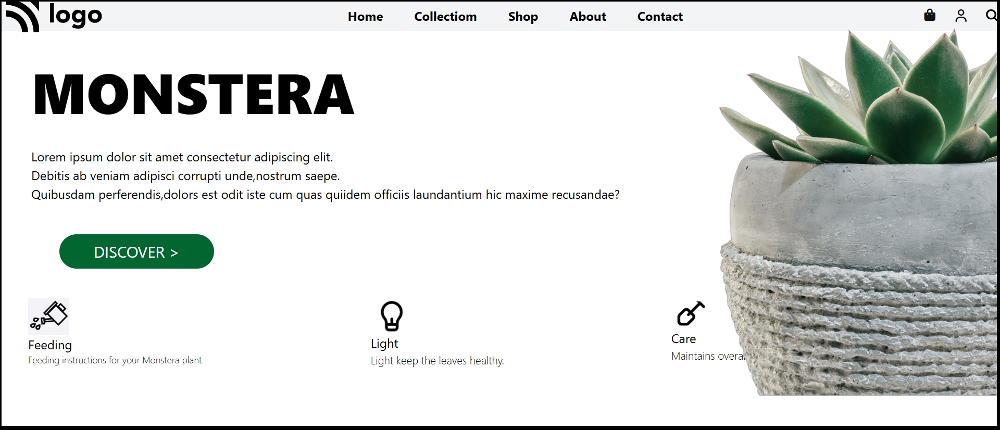

 ## Monstera Plant Website
A responsive, modern landing page for a Monstera plant product/brand built using HTML, Tailwind CSS, and Font Awesome.

## Sample 

## 📌 Project Overview
This project is a minimal and elegant plant-themed landing page showcasing a Monstera plant collection. It includes a navigation bar, hero section, category icons, and responsive images designed using Tailwind CSS utility classes.

## 🚀 Features
✔ Fully Responsive Layout
Designed with Tailwind CSS for seamless display across mobile, tablet, and desktop screens.
✔ Modern Navbar
Contains:

Logo

Navigation links (Home, Collection, Shop, About, Contact)

Icons (Cart, User, Search)

✔ Hero Section
Large headline “MONSTERA” with a short product description and CTA button (Discover).
✔ Category / Info Icons
Three sections explaining:

Feeding

Light

Care

Each with respective icons and short descriptions.
✔ Clean UI & Plant-Themed Colors
Uses green tones and a simple layout for a natural look.
✔ Optimized for Mobile
Uses Tailwind’s breakpoint utilities (md:, sm:) to show/hide elements like the plant images.

## 🛠️ Tech Stack

HTML5

Tailwind CSS (via CDN)

Font Awesome Icons

Responsive Images

📂 Project Structure
/project-folder
 ├── index.html
 ├── Logo.svg
 ├── water plant.png
 ├── one.png
 ├── two.png
 ├── 03_flower.png
 └── 03_flowerCut.png

